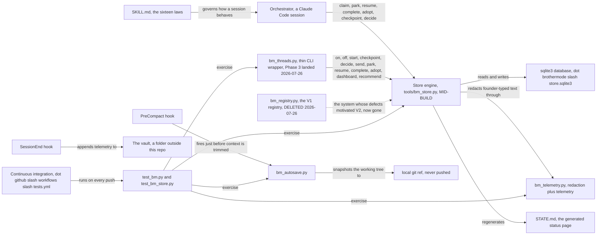

# BrotherMode V2, architecture

This is the one-page map, for the founder or for anyone else being handed
this project, to read before opening any other document in this pack.

## What this system is, in plain terms

BrotherMode is not an app and not a product with a login screen. It is a
written rulebook plus a small set of helper programs that a Claude Code AI
assistant loads before doing any sizable piece of work for its founder.
Think of the rulebook (`SKILL.md`) as an employee handbook: it tells the
assistant how to behave, check its own memory, never let two workers touch
the same file at once, always show proof instead of just claiming success.
Think of the small set of helper programs as a filing cabinet that lives on
the founder's own computer: it is where the assistant writes down who is
doing what, so nothing gets lost when a session ends and nothing gets
double-booked when two pieces of work happen at once. That filing cabinet,
called the store, is being rebuilt right now, and the rebuild is what this
documentation pack is about. Nothing in this system talks to the internet;
`SECURITY.md` states plainly that it makes no network calls.

## Component map

## The components, one job each

**SKILL.md, the law.** One job: define how a session classifies work,
assigns roles, delegates, fences files before writing, budgets tokens,
researches, self-scores, and stores memory, across sixteen numbered
sections. Input: read at the start of any sizable task, and re-read after
any compaction or resume. Output: the behavior of the session itself, not a
file or a return value. Failure mode: none directly; the file states its own
recovery instruction, to re-read specific sections after any memory loss.

**Store engine, `tools/bm_store.py` (MID-BUILD).** One job: be the sole
transactional authority on who owns what work, per the ratified Decision 2.
Input: CLI commands or direct calls (claim, the park and resume and complete
and adopt family, checkpoint, decide, send). Output: record snapshots, the
generated `STATE.md` view, rendered handovers, a full JSON export, and a list
of invariant problems from `verify`. Failure mode: it either refuses a
specific, named request (an `OwnershipRefused` or a `StaleIdentity`) or, if
the database file itself cannot be read, quarantines it (a `StoreCorrupt`)
rather than ever guessing or silently recreating it.

**The sqlite database file.** One job: durably hold every record, claim,
decision, digest, directive, delivery, and transition. Input: writes from the
store engine only. Output: reads by the store engine only. Failure mode: if
it is found unreadable, it is renamed aside and kept, never deleted;
`SECURITY.md` documents this file as sensitive, since founder-typed text
lives inside it in raw form.

**`bm_telemetry.py`, redaction and telemetry.** One job: be the single owner
of secret redaction in this codebase, plus capture session telemetry and
correction candidates. Input: text about to leave the store as a generated
view, plus session events. Output: redacted text, and lines appended to
`outcomes.jsonl` and `corrections.jsonl` in the vault. Failure mode: if it
cannot be loaded, the store engine refuses to render generated views at all,
rather than showing founder-typed text unredacted.

**`bm_registry.py`, the deleted V1 registry.** Was one job: the JSON-file-based
system that came before the store engine, writing `threads/registry.json` and
`threads/REGISTRY.md`. DELETED 2026-07-26 (Phase 3, commit `c9e3540`), not
shimmed: its confirmed defects (silent name takeover, two registries minted
for one project, a truncated fingerprint dropping a handover, and more) are
gone along with the file itself.

**`bm_threads.py`, now a thin CLI wrapper over the store (Phase 3, landed
2026-07-26).** One job: give thread mode (`on`, `off`, `start`, `checkpoint`,
`decide`, `send`, `park`, `resume`, `complete`, `adopt`, `dashboard`,
`recommend`) a command-line surface, with the store engine as the only place
ownership or lifecycle state actually lives; this file keeps no second copy
of "active." Input: CLI subcommands. Output: the same store records
`bm_store.py` produces directly, plus each thread's own `STATE.md`,
`inbox.md`, `outbox.md`, `digest.md` files under `threads/<name>-<id>/`.
Failure mode: the rewiring surfaced five execution-confirmed defects on
2026-07-26 (`docs/superpowers/specs/2026-07-26-release-blockers.md`); four
were fixed the same day (a broken off/resume reversibility promise, a
world-readable recovered worktree, a stale post-thread-command `verify`
result, and missing flag-name validation), re-verified directly as fixed
while this pack was corrected. One remains open, re-confirmed the same way:
a refused adoption attempt still writes its "Adopted from dead/stalled
thread" handover into `STATE.md` even though the adoption did not happen.
See `docs/KNOWN-LIMITS.md` for the current detail; this project's code
changes fast enough that either document can go stale within the hour, so
re-run the reproduction steps rather than trust a date alone.

**`bm_autosave.py`.** One job: snapshot the entire working tree, including
files never added to git, at the moment a session's context is about to be
trimmed. Input: the live working tree. Output: a private, local-only git
reference that is never pushed; `recover` restores it. Failure mode: none
stated beyond best-effort. Planned (Phase 2): ported to Python, so the
Windows requirement does not depend on a shell script.

**The vault.** One job: hold the founder's durable memory outside this
repository entirely, session logs, a model of the founder's own decision
patterns, and the telemetry ledgers. Input: written at milestones and at the
close of every session. Output: read at the start of the next session.
Failure mode: `README.md` is explicit that this repository ships only an
empty starting template; what grows inside a founder's own copy is never
committed back to this project.

**Continuous integration, `.github/workflows/tests.yml`.** One job: run the
regression suites automatically on every push and pull request. Input: the
repository's own source. Output: a pass or fail check. Failure mode: a red
check blocks a merge only once it is paired, as `README.md` recommends, with
GitHub's own required-status-check setting on the protected branch; the
workflow file alone does not enforce that pairing.

## Phase roadmap

Source: `docs/superpowers/specs/2026-07-26-brothermode-v2-design.md` lines
219 to 233. No calendar dates exist in any source read for this pack, so none
are invented here; each phase is separately gated rather than scheduled.

| Phase | What it delivers | Status as of this pack |
|---|---|---|
| 1. Engine core | The store, root resolution, identity rules, the two failure policies, and `verify` | MID-BUILD: `tools/bm_store.py` and `tools/test_bm_store.py` exist and are being actively fixed against the Phase 1 fix round |
| 2. Recovery | `bm_autosave.py`, a Python port of the current shell script, per-worktree and per-session snapshot references, receipts written into `autosave_receipts`, retention, and recovery only into a separate worktree | Planned (Phase 2); the `autosave_receipts` table already exists in the schema so this phase needs no migration |
| 3. Command surface | Thread mode rebuilt on top of the store; the off, adopt, and drain flows made transactional; a generated `STATE.md` everywhere; `bm_threads.py` reduced to a thin command-line layer over the store | LANDED 2026-07-26, with open defects: see `docs/superpowers/specs/2026-07-26-release-blockers.md` and `docs/KNOWN-LIMITS.md` before relying on it |
| 4. Method layer | Project scaffolding (README, an intake document, an architecture document, a documentation pack, a decisions folder), a simplicity law, problem-first intake, and a handover generator | Planned (Phase 4) |
| 5. Product | Windows validation, the full continuous integration matrix, onboarding (an Obsidian-based vault by default, an optional off-by-default Mem0 adapter), a tagged 2.0.0 release with checksums, and a sync script between the public and private repositories | Planned (Phase 5) |
| 6. Dogfood evidence | A recorded review of the store replacing the ephemeral fence mechanism in real use, with measured signals, dated 2026-08-08 in the ratified spec | Planned (Phase 6) |

## Open questions and discrepancies found while writing this pack

`tools/bm_store.py` was read once, on 2026-07-26, for orientation only, as
instructed, and is being actively edited by someone else. Everywhere it
disagreed with the ratified spec or the Phase 1 fix round as of that single
read, the spec is treated as the source of truth in the rest of this pack,
and the disagreement is only recorded here, not documented as the system's
actual behavior. None of the following should be read as a final verdict on
the code; they are a snapshot, and may already be resolved by the time this
is read.

- **Case folding still calls the platform's own normalization function.**
  Fix-round Gate 2 (`docs/superpowers/specs/2026-07-26-phase1-fix-round.md`
  lines 34 to 43) requires comparison to use a plain lowercase or casefold
  operation instead of the platform's own case-normalization call, because
  that call is known to also rewrite path separators on Windows. As read,
  `tools/bm_store.py` lines 212 to 226 (`_normcase`) call
  `os.path.normcase(p)` first and only additionally lowercase the result on
  macOS, so the Windows path still runs through the exact function the gate
  says must not be relied on.
- **Path canonicalization (Gate 1) was not visible.** The fix round
  (lines 19 to 31) requires every incoming claim path to be resolved against
  a caller's working directory, checked for escaping the project root
  through `..` or a symlink, and normalized through a standard path-cleanup
  function. As read, `tools/bm_store.py` lines 197 to 209 (`_to_posix`) only
  strip a leading `./`, collapse doubled slashes, and strip a trailing
  slash; no caller-cwd parameter, no `..` resolution, and no `path-escape`
  refusal were found anywhere in the file.
- **The empty-session self-match (Gate 3) and the CLI's own session id
  (its required fix) were not visible.** As read, `tools/bm_store.py` line
  784 still compares `(active["session_id"] or "")` to `(session_id or "")`,
  which treats two empty session ids as equal, and `cmd_claim` (lines 1370
  to 1395) does not generate a per-process id when `--session` is omitted.
- **Quarantine (Gate 5) moves only the main database file.** The fix round
  (lines 69 to 79) requires a corrupted store's `-wal` and `-shm` sidecar
  files to move together with it, into a uniquely named, per-incident
  directory. As read, `_quarantine_and_raise` (lines 634 to 657) renames only
  `store.sqlite3` itself, to a second-precision timestamp suffix, with no
  sidecar handling.
- **Corruption discovered outside the constructor (Gate 4) was not visible.**
  The fix round (lines 59 to 67) requires one shared internal helper wrapping
  every sqlite call so a `DatabaseError` raised deep inside a later operation
  is quarantined the same way a corrupt-at-open database is. As read, the
  claim, transition, checkpoint, decide, send, dump, and verify methods issue
  direct `conn.execute(...)` calls with no such shared wrapper visible.
- **ASCII-only names and the encoding-failure ordering fix (Gate 9) were not
  visible.** The fix round (lines 114 to 125) requires rejecting
  non-printable or non-ASCII names and catching `UnicodeEncodeError` before
  the general `ValueError` handler. As read, `valid_name` (lines 158 to 179)
  does not check for non-ASCII characters, and `main`'s exception handling
  (lines 1533 to 1554) has no `UnicodeEncodeError`-specific branch ahead of
  its `ValueError` branch.
- **The cross-session ownership check on transitions (Soft 10) was not
  visible.** The fix round (lines 128 to 134) requires every transition
  except adoption to be refused when the caller's session id differs from
  the record's own. As read, `transition` (lines 832 to 882) checks the
  lifecycle identity, the expected version, and the legal source state, but
  does not compare session ids for any move.

No requirement in `REQUIREMENTS.md` could be traced to any source document
read for this pack without a citation; every requirement there carries one.
