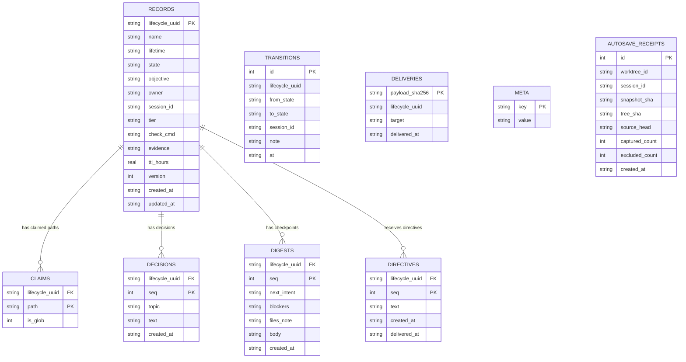

# BrotherMode V2, data model

This file is for anyone deciding what BrotherMode is allowed to hold,
reviewing a privacy claim, or trying to understand what one table is for
before changing it. It explains the store schema (schema version 1) table by
table in plain language, then gives the same structure as a diagram. Source:
`docs/superpowers/specs/2026-07-26-brothermode-v2-design.md` lines 52-92 (the
DDL), `SECURITY.md` lines 9-44, and `INVARIANTS.md` (why the store exists at
all, I1 through I9).

Everything described here lives in one file: `<project root>/.brothermode/store.sqlite3`.
It is created inside the founder's own project folder, not inside the vault,
and not sent anywhere: `SECURITY.md` states plainly that BrotherMode makes no
network calls.

## The tables, one by one

### `meta`

**What it holds:** three key and value pairs, the schema version number, a
random project identifier, and when the store was first created.

**Why it exists:** so the engine can tell, just by opening the file, whether
its own structure is old and needs a future migration, and so each project
has one stable identity that does not depend on its folder name or its git
history.

**What breaks without it:** a future version of the tool would have no way
to know whether it is safe to read this database, and no reliable way to
tell two different projects apart if their folders were ever renamed or
moved.

**Sensitive text:** none. This table never holds anything the founder typed.

### `records`

**What it holds:** one row per unit of work. Its permanent identity
(`lifecycle_uuid`), a human label (`name`), whether it is meant to be short
lived or ongoing (`lifetime`), its current status (`state`), the objective in
the founder's own words, who owns it, which session created it, a difficulty
or scope tier, the exact command that proves it is done (`check_cmd`), the
proof once it is done (`evidence`), an optional expiry, a version number, and
when it was created and last touched.

**Why it exists:** this is the one and only authority on who owns what work
right now. Nothing else in the system, not a dashboard, not a status page, is
allowed to be the source of truth for this.

**What breaks without it:** two people, or two AI helpers, could believe they
each own the same piece of work at the same time, which is the exact failure
this whole engine was rebuilt to close.

**Sensitive text:** `objective`, `tier`, `check_cmd`, and `evidence` are
founder-typed. Every one of them is redacted before it is ever shown outside
this file (in a generated status page, a summary, or a terminal line).

### `claims`

**What it holds:** which file paths, or file path patterns, each record has
staked out as its own, one row per path.

**Why it exists:** this is the mechanism behind the single-writer rule. It is
what makes it possible to compute, mechanically, whether two pieces of work
would touch the same files.

**What breaks without it:** the "one owner per name" rule alone would not be
enough; two differently named pieces of work could still quietly edit the
same files at the same time.

**Sensitive text:** the `path` column is the founder's own folder and file
structure. It is redacted the same way other founder text is before it
appears in a generated view.

### `decisions`

**What it holds:** a running, append-only log of decisions tied to one unit
of work: a short topic and the decision text itself, in order.

**Why it exists:** so the reasoning behind a choice made mid-task is not lost
the moment a session ends. This is part of what `INVARIANTS.md` calls
losslessness, every checkpointed decision must still be findable later.

**What breaks without it:** whoever picks the work back up later has to
guess why an earlier choice was made, or ask the founder to remember it.

**Sensitive text:** `topic` and `text` are founder-typed and redacted at
every exit.

### `digests`

**What it holds:** the handover content for one unit of work at one point in
time: what should happen next, what is blocking progress, notes about which
files matter, and a free-form body, one row per checkpoint.

**Why it exists:** this is exactly what a resuming session, or a brand new
helper picking up someone else's work, reads first. It is the mechanism
behind the promise that nothing checkpointed is ever lost.

**What breaks without it:** every session death would erase whatever plan
was in progress, forcing every resumption to start from nothing.

**Sensitive text:** all four text fields, `next_intent`, `blockers`,
`files_note`, and `body`, are founder-typed and redacted at every exit.

### `directives`

**What it holds:** messages sent into an active unit of work from outside it
(for example from an orchestrating session), plus when each one was actually
read.

**Why it exists:** gives a way to leave an instruction for ongoing work
without interrupting whoever is doing it right that moment.

**What breaks without it:** there would be no way to redirect a long-running
piece of work except by stopping it outright.

**Sensitive text:** the `text` field is founder-typed and redacted at every
exit.

### `deliveries`

**What it holds:** a record of every handover payload that has actually been
delivered, keyed by a full 64-character fingerprint of that exact payload's
contents.

**Why it exists:** to guarantee a handover is delivered exactly once per
distinct version of its content. This is `INVARIANTS.md`'s "exactly once, per
version" promise, I2: a retry of the same content must not duplicate it, but
content that changed must still go out, which is exactly the case a short,
truncated fingerprint got wrong before (two different handovers collided on
the same short fingerprint and the second one was silently dropped).

**What breaks without it:** either duplicate handovers pile up, or, worse,
a genuinely new handover gets mistaken for a repeat and never delivered.

**Sensitive text:** none directly stored here beyond the fingerprint itself
and a target label; the underlying payload's sensitive fields live in the
tables above.

### `transitions`

**What it holds:** an append-only audit trail of every state change a record
has ever gone through: what it moved from, what it moved to, which session
did it, an optional note, and when.

**Why it exists:** this is what lets the system check its own honesty. A
record's current state should always match the last thing its own history
says happened to it; if it does not, something is wrong and the mismatch is
detectable rather than silent.

**What breaks without it:** there would be no way to reconstruct how a record
got to its current state, and no way to catch a record whose status
disagrees with its own history.

**Sensitive text:** `note` could contain founder-typed text and is redacted
if it is ever rendered in a generated view.

### `autosave_receipts`

**What it holds:** a record of one automatic working-tree snapshot: which
worktree and session made it, the snapshot's own identifiers, how many files
were captured, how many were deliberately excluded, and when.

**Why it exists:** this table ships now, empty and unused, specifically so
that the recovery feature planned for Phase 2 needs no change to the database
structure when it arrives. Nothing writes to this table yet.

**What breaks without it (later):** Phase 2's recovery feature would need a
structural change to an already-shipped database, which is exactly the kind
of migration this design set out to avoid needing.

**Sensitive text:** none of the columns here are founder-typed free text.

## Which fields hold sensitive, founder-typed text, stated plainly

`records.objective`, `records.tier`, `records.check_cmd`, `records.evidence`,
`claims.path`, `decisions.topic`, `decisions.text`, `digests.next_intent`,
`digests.blockers`, `digests.files_note`, `digests.body`, and
`directives.text`. Every one of these is redacted before it leaves the store
as a generated view (a status page, a rendered handover, a dashboard line, or
terminal output). The raw, unredacted versions exist in exactly one place:
inside the sqlite file itself, which `SECURITY.md` documents as sensitive and
recommends treating the same way as a corrections log. The one deliberate,
documented exception is a full raw export function meant for a human
inspecting the file by hand or for a future migration; it is never used for
anything the founder or a helper would casually read on screen. If the
database is ever found corrupt, it is renamed aside and kept, never deleted,
so the quarantined file is exactly as sensitive as the live one.

## Entity relationship diagram

`TRANSITIONS`, `DELIVERIES`, `META`, and `AUTOSAVE_RECEIPTS` are shown
without a drawn relationship line because the schema itself does not declare
a foreign key from them back to `RECORDS`: `transitions` and `deliveries`
both store a `lifecycle_uuid` as a plain text value for lookups rather than
as an enforced foreign key (unlike `claims`, `decisions`, `digests`, and
`directives`, which do declare `REFERENCES records(lifecycle_uuid)`), `meta`
is a standalone key and value table, and `autosave_receipts` is keyed by
worktree and session, not by any single record.
