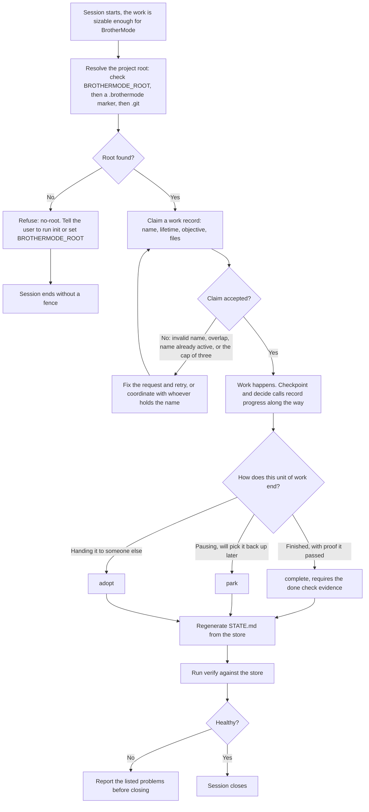
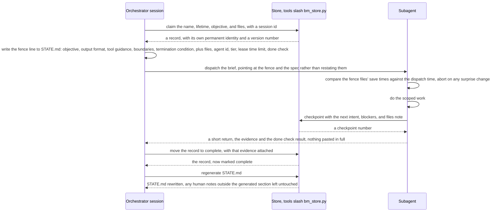
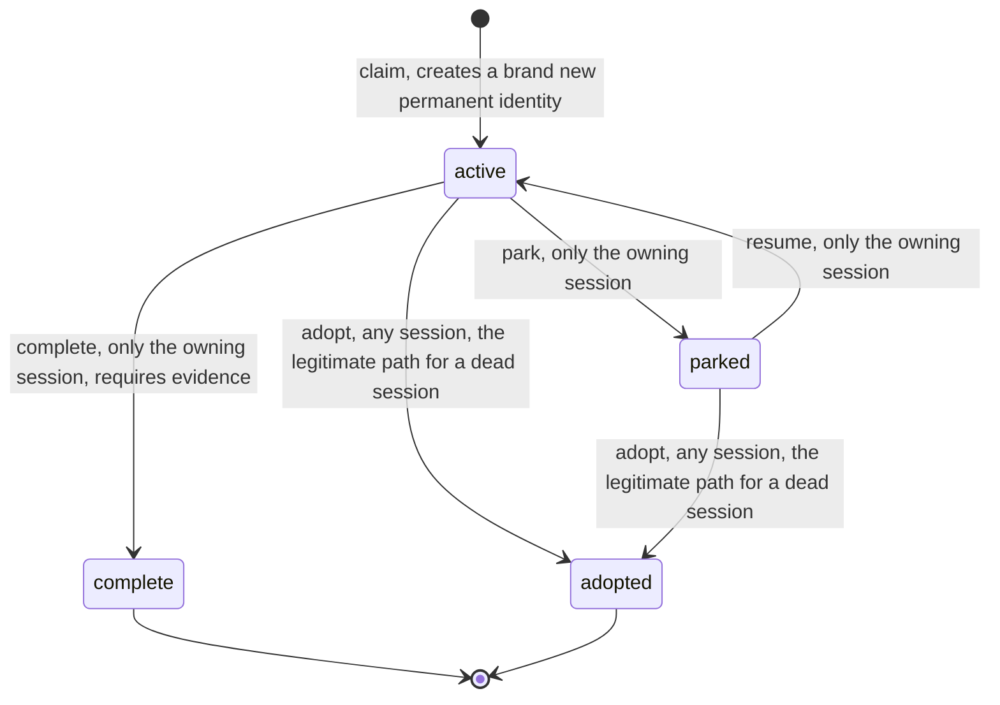
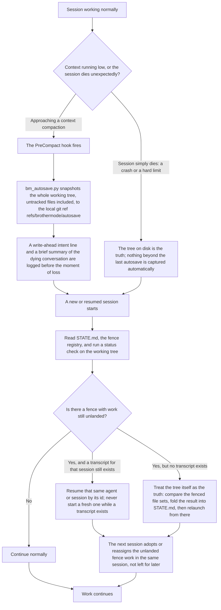

# BrotherMode V2, process maps

This file is for anyone who wants to see how a real work session actually
flows, step by step, including what happens when a session dies partway
through. It is written for a founder who has never read a state machine
diagram before: each diagram is followed by a plain-language paragraph that
stands on its own.

Four processes are covered: a session from start to close, a fenced handoff
to a subagent, the lifecycle of one unit of work, and recovery after a
session dies.

---

## a. A session, start to close

**In plain words:** before anyone can claim a piece of work, the tool has to
find the project's home base (the "root"). If it cannot find one, it refuses
outright and tells the person exactly what command fixes that, rather than
guessing where to put things. Once the root is known, claiming a piece of
work is like signing a whiteboard: you write down what you are working on and
which files it touches. If someone else already has that name signed out, or
your files overlap with someone else's, you get told clearly why and what to
do instead. While the work happens, short check-ins ("checkpoints") get saved
so nothing depends only on human memory. When the work is done, paused, or
handed off, the tool rewrites its own status page and then checks its own
math before letting the session close.

---

## b. Fence then dispatch: an orchestrator sending work to a subagent

**In plain words:** before an orchestrator hands work to a helper (a
"subagent"), it first writes down, in one place, exactly what files that
helper is allowed to touch and how it will prove the work is done. Only after
that is written down does the helper start. The helper double-checks nothing
changed those files behind its back before it begins, does the work, and
reports back briefly rather than dumping everything it did. The orchestrator
then marks the work complete with the proof attached, and the status page
updates itself. The point of doing it in this order, fence first, dispatch
second, is that two helpers can never be given the same files by accident,
because the claim would simply be refused.

---

## c. The lifecycle of one work record

**In plain words:** a piece of work starts life as **active** the moment it
is claimed, and gets a permanent ID that is never reused, even if the same
name is used again later for different work. From active, only the session
that owns it can pause it (**parked**) or finish it (**complete**, which
needs proof attached). A parked piece of work can be picked back up
(**active** again) only by that same owning session. The one exception is
**adopted**: if a session dies and never comes back, any other session is
allowed to take over an active or parked record, because otherwise dead work
would sit locked forever. Complete and adopted are end states for that
lifecycle; a new piece of work under the same name would get its own, brand
new identity rather than reopening an old one.

---

## d. Recovery after a session dies

**In plain words:** two different bad things can happen to a session: it can
run out of working memory gracefully (a "compaction"), or it can simply die
(a crash, or hitting a hard limit). For the graceful case, a hook fires just
before the memory gets trimmed and takes a snapshot of literally everything
in the working folder, including files that were never saved to version
control, tucking it away in a private spot that is never pushed anywhere.
For the hard-crash case, there is no such warning, so whatever was last
written to disk is what recovery works from. Either way, the next session
that starts always re-reads the shared status page and checks what is
actually on disk before doing anything else, rather than trusting its own
memory of what happened. If it finds a piece of work that someone started but
never finished, it either picks that exact work back up (if there is a
transcript to resume) or treats the files on disk as the ground truth and
folds them back into the status page. The system is built so that dying
mid-task loses, at worst, a little progress, never the whole picture of what
was being done.

Note: this diagram covers a session dying. A separate, unrelated situation,
the database file itself being found corrupt, is covered in `QA-GATES.md`
and `DATA-MODEL.md`, because that recovery path (quarantine, then `init`
again) does not depend on why a session ended.
