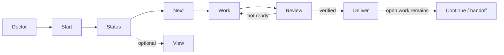

# Workflow Map

This page shows where each BrotherMode command fits, what it produces, and what must be verified before moving forward.

## Normal Development Path



## Phase 0: Installation Health

| Workflow | Purpose | Produces | Gate |
| --- | --- | --- | --- |
| `/brothermode:doctor` | Check plugin wiring and installation health | PASS/FAIL/SKIP checks | No `FAIL` before blaming project behavior |
| `/brothermode:update` | Compare installed version with available release | Version/update guidance | Update intentionally, then run Doctor again |

## Phase 1: Establish the Work

| Workflow | Purpose | Produces | Gate |
| --- | --- | --- | --- |
| `/brothermode:start <goal>` | Record the outcome, scope, and first decision | Project records and `CANVAS.md` | Goal and scope match the requested work |
| `/brothermode:status` | Read the project from records | Eight-field status | No invented progress or evidence |

Use Start once for the bounded project/change. Use Status repeatedly as the read path.

## Phase 2: Select Work

| Workflow | Purpose | Produces | Gate |
| --- | --- | --- | --- |
| `/brothermode:next` | Select one ready task | One next action plus reason | Task is ready, or a blocking decision is surfaced |
| `/brothermode:status` | Re-check before changing direction | Current goal, risk, evidence, next step | Current state is still consistent with reality |

## Phase 3: Implement

Implementation happens through ordinary Claude Code interaction.

BrotherMode's job during this phase is to preserve state and coordinate writes, not to require a slash command before every edit.

| Mechanism | Purpose | What to do as a developer |
| --- | --- | --- |
| File ownership/fence | Prevent supported foreign writes to claimed files | Do not bypass a refusal. Resolve ownership first. |
| Bash audit | Detect relevant shell-side changes where prevention is not available | Treat alerts as evidence of a coordination problem. |
| Durable records | Keep decisions/progress outside chat memory | Use Status rather than reconstructing state from conversation. |

## Phase 4: Verify

| Workflow | Purpose | Produces | Gate |
| --- | --- | --- | --- |
| `/brothermode:review <task-id>` | Check work against definition of done | Evidence and pass/not-yet verdict | Required checks cover the latest relevant change |
| project tests/checks | Prove the code behavior itself | Test/build/lint output | Project-specific checks pass |

The review loop is intentionally cyclic:

```text
REVIEW -> gap found -> FIX -> rerun checks -> REVIEW
```

Do not skip directly from implementation to delivery because the code looks finished.

## Phase 5: Deliver

| Workflow | Purpose | Produces | Gate |
| --- | --- | --- | --- |
| `/brothermode:deliver` | Package verified work for handoff | `DELIVERY-PACKET.md` | Delivery succeeds only with required evidence |
| `/brothermode:view` | Generate a human-readable status snapshot | `PROJECT-VIEW.html` | Treat as a snapshot, not a live authority |

A delivery refusal is a valid workflow result. It means the release condition has not been met.

## Continuity Path

When a session ends while open work remains, BrotherMode also has a continuity path.

The public shell boundary includes:

```bash
brothermode continue --dry-run
brothermode continue
```

Use `--dry-run` to generate the handoff and print the successor command without launching it.

The continuity system generates its packet from project records and distinguishes successor outcomes such as `SPOKE`, `RUNNING`, and `GONE`. A successful process launch proves liveness, not comprehension.

Normal users do not need to invoke this during every task. It matters when work must continue across sessions.

## Recovery Path

Recovery is separate from continuity.

```bash
brothermode recover
```

Recovery uses compact-boundary autosave snapshots. It is not continuous backup. Work created after the latest available snapshot may not be recoverable through this mechanism.

## Read Path vs Write Path

| Operation | Type | Why it matters |
| --- | --- | --- |
| `status` | Read | Safe orientation from records |
| `next` | Read/recommend | Selects recorded ready work |
| `view` | Generated render | Writes a snapshot, not authoritative state |
| `start` | Write | Creates/updates project state |
| `review` | Write | Records evidence and task transition |
| `deliver` | Write | Creates delivery packet after gate checks |
| `continue` | Write/launch | Generates handoff, may launch successor |
| `doctor` | Read | Checks installation health |
| `update` | Read/report | Reports update path, user controls the actual update |

## Which Path Should I Use?

| Situation | Path |
| --- | --- |
| First time using BrotherMode | Doctor -> Start -> Status -> Next -> Work -> Review -> Deliver |
| Existing project, small change | Start the bounded change -> Status -> Next -> Work -> Review -> Deliver |
| Unsure what is happening | Status |
| Unsure what to do next | Next |
| Need visual project state | View |
| Task looks complete | Review |
| Work is ready to hand to someone | Deliver |
| Session must hand work to another session | Continue |
| BrotherMode itself looks unhealthy | Doctor |
| Recover after lost session context/work | Recover, with snapshot limitations understood |
