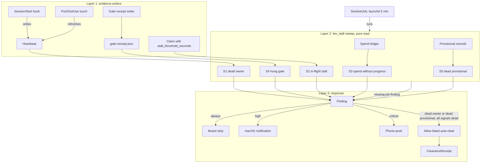

# 06. Diagrams as code

One diagram, the evidence flow across the three layers of 02-process.md.
Every node traces to an entity in 05-data-model.md or a component below.

## Components
- AC: the allow-listed auto-clear, layer 3 of 02-process.md, producing one ClearanceReceipt per action.
- BD: the board strip on the command center, where every finding lands.
- CL: the Claim entity as the sweep reads it, carrying stall_threshold_seconds.
- GR: the gate receipt writer inside tools/test_all.py (RF-5, live at 943c59a).
- LJ: the SentinelJob's launchd runner, com.brothermode.sentinel.
- MN: the macOS notification channel for HIGH findings.
- PP: the phone push channel for CRITICAL findings.
- PR: the provisional records the sweep reads from the store.
- PT: the PostToolUse touch that refreshes a heartbeat at most once per minute.
- RC: the gate-receipt.json file the gate writes into the store's private directory.
- S1: signal 1, dead owner detection.
- S2: signal 2, in-flight stall detection.
- S3: signal 3, spend without progress detection.
- S4: signal 4, hung gate detection.
- S5: signal 5, dead provisional detection.
- SP: the spend ledger the machine spend guard maintains.
- SS: the SessionStart hook that writes the heartbeat.
- detector: layer 2 as one unit, the bm_stall sweep the SentinelJob runs each interval.

