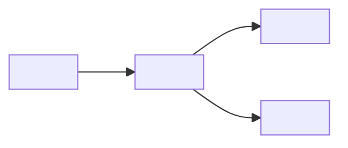

# <Project name>, architecture

What this is: the one-page map of the whole system, for the founder or for
anyone being handed this project, to read before opening any other document.
Who reads it: same audience as `README.md`, but one layer deeper into how the
pieces actually connect.

## What this system is, in plain terms

<Two or three sentences, no jargon, the way you would explain it to a friend.
Worked example: "This is a small script plus a database table. A member asks
for their data, the script reads their rows, and it emails them a CSV file.
There is no server it talks to and nothing runs unless someone triggers it.">

## Component map

Fill in the skeleton below with your own pieces. Delete any node you do not
need; add more the same way. Keep every arrow labeled with what actually
flows across it, not just that something does.

## The components, one job each

For each real component, use this shape (worked example given for the first
one; replace with your own and add or remove rows as needed):

**<Component name>.** One job: <the single thing it is responsible for, not a
list>. Input: <what it receives>. Output: <what it produces>. Failure mode:
<what happens when it breaks, and whether that failure is loud or silent>.

Worked example:

**Export script.** One job: turn one member's workout rows into a CSV file.
Input: a member id. Output: a CSV file written to disk, or a named error if
the member has no rows. Failure mode: if the database is unreachable, the
script exits with a clear error message and writes nothing, rather than
producing an empty or partial file.

## Phase roadmap

<Only fill this in if the project is genuinely being built in separate,
gated phases. Delete this section if it is a single small piece of work with
no phases. Each phase should be separately gated (has its own done-check),
never just scheduled by calendar date.>

| Phase | What it delivers | Status |
|---|---|---|
| 1. <name> | <what ships> | <planned, in progress, or done, stated as of today's date> |

## Open questions

<Anything you noticed while writing this file that you are not sure about
yet. Better to write it down here than to silently assume an answer. Delete
this section once there are none left, or keep adding to it as new ones
appear.>

- <question, and who or what would need to answer it>
