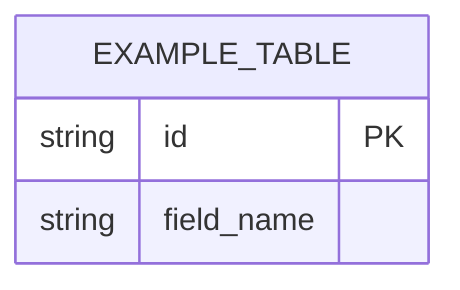

# <Project name>, data model

What this is: what this project is allowed to hold, table by table or model
by model, in plain language, so a privacy question or a "what is this field
for" question never requires reading the code cold. Who reads it: a founder
reviewing a privacy claim, and an engineer or AI session about to touch
storage.

For every real table, file, or stored structure, use this shape (a worked
example is given first; replace it and repeat for every real one you have).

## `<table or structure name>`

**What it holds:** <the fields, in plain words, not just their column
names.>

**Why it exists:** <what would be impossible or unsafe without it.>

**What breaks without it:** <the concrete failure, not a vague "things would
not work.">

**Sensitive text:** <name every field that holds something a real person
typed or that identifies them, or write "none" if genuinely none does. Say
what happens to that field before it is ever shown outside this storage,
for example redacted, encrypted, or never exported at all.>

Worked example:

## `export_requests`

**What it holds:** one row per export a member has asked for: the member id,
when it was requested, and when the file was actually generated.

**Why it exists:** so a second request for the same member does not silently
regenerate a file that is already sitting in someone's inbox, and so there is
a record to check if a member says they never received what they asked for.

**What breaks without it:** duplicate emails to the same member, and no way
to answer "did we actually process this" without checking the mail server
logs by hand.

**Sensitive text:** the member id identifies a real person. It is never
shown in any log line without being checked against who is allowed to see
it, and it is never included in the CSV file itself, which only contains
that member's own workout rows.

## Diagram

<Fill in once you have more than one real table or structure; a single
table needs no diagram. Mermaid entity relationship syntax, the same shape
BrotherMode's own `docs/ba/DATA-MODEL.md` uses, is a reasonable default.>

