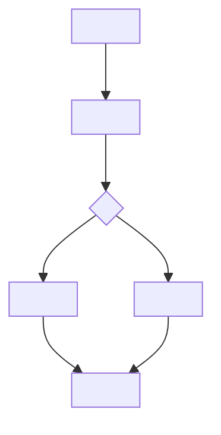
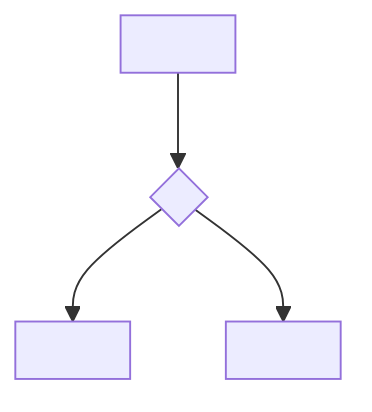

# <Project name>, process maps

What this is: how a real run of the system actually flows, step by step,
including what happens when something fails partway through. Who reads it:
a founder who wants to see the behavior without reading code, and an engineer
or AI session onboarding onto the project. Written for someone who has never
read a state machine diagram before: every diagram is followed by a plain
paragraph that stands on its own without the diagram.

Cover at minimum: the normal path from start to finish, and what happens on
the most likely failure. Add more processes as your project grows enough real
branches to need them.

---

## a. <Name of the normal path, start to finish>

**In plain words:** <Describe the same flow in a paragraph a non-engineer
could read without ever looking at the diagram. Worked example: "A request
for an export comes in with a member id. The script checks whether that
member has any workouts logged. If they do, it writes a CSV file and reports
where it went. If they have none, it says so plainly instead of producing an
empty, confusing file.">

---

## b. <Name of the most likely failure path>

**In plain words:** <Same rule as above, plain paragraph, stands alone.
Worked example: "If the database cannot be reached while building the file,
the script stops immediately and prints a clear error rather than writing a
half-finished file. Nothing partial is ever left where someone might mistake
it for a real export.">

---

<Add more lettered sections the same way as your project grows: a handoff
between two parts of the system, a recovery path after a crash, and so on.
Delete this line once real processes replace the two worked examples above.>
